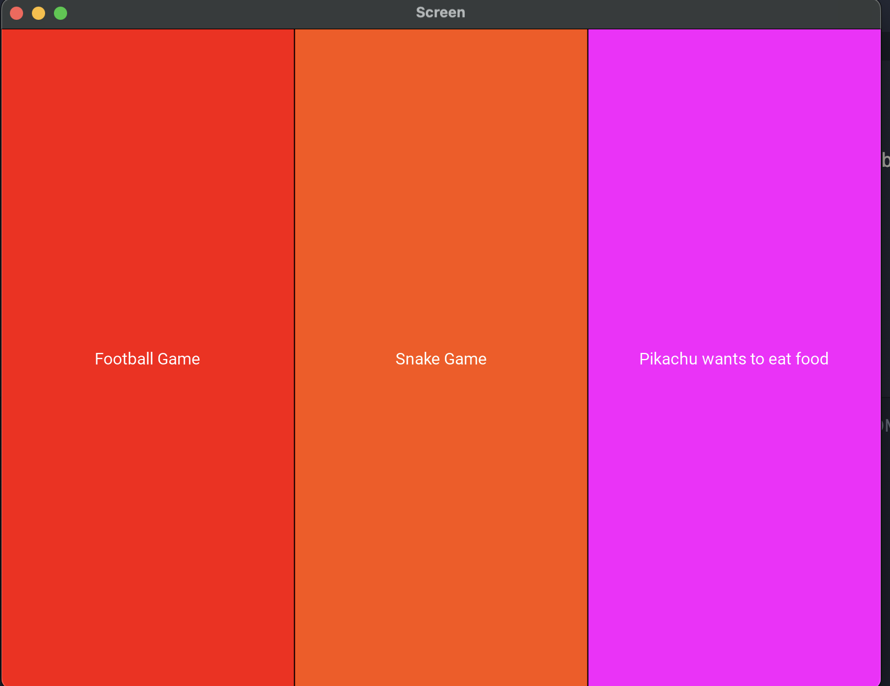

# kivy-game-browesr
KIVY WITH MULTIPLE GAMES TO CHOOSE


# Kivy Python Code

This repository contains Python code that utilizes the Kivy framework for building user interfaces. It includes classes and functions for creating a soccer game and a snake game.

## Dependencies

The code requires the following dependencies to be installed:

- `kivy`: The main Kivy library.
- `random`: A Python module for generating random numbers.

## Soccer Game

)

The soccer game consists of the following components:

- `Menu`: Represents the menu screen of the application.
- `game_over`: Represents the game over screen of the soccer game.
- `winning`: Represents the winning screen of the soccer game.
- `SoccerPlayer`: Represents the soccer player in the game.
- `SoccerBall`: Represents the soccer ball in the game.
- `SoccerGame`: Represents the soccer game itself.
- `soccerscreen`: Represents the screen where the soccer game is displayed.

## Snake Game

The snake game consists of the following components:

- `SnakeTail`: Represents a tail segment of the snake.
- `SnakeGame`: Represents the snake game itself.

)

## Pokemon Game

The Pokemon game consists of the following component:

- `PokemonFoodPicker`: Represents the screen where the player picks a type of food.

)

## Usage

To run the soccer game, execute the `soccer.py` file:

```bash
python soccer.py
```
To run the snake game, execute the snake.py file:
```bash
python snake.py
```
To run the Pokemon game, execute the pokemon.py file:
```bash
python pokemon.py
```
## Contributing
Contributions to this project are welcome. Feel free to submit bug reports, feature requests, or pull requests.
